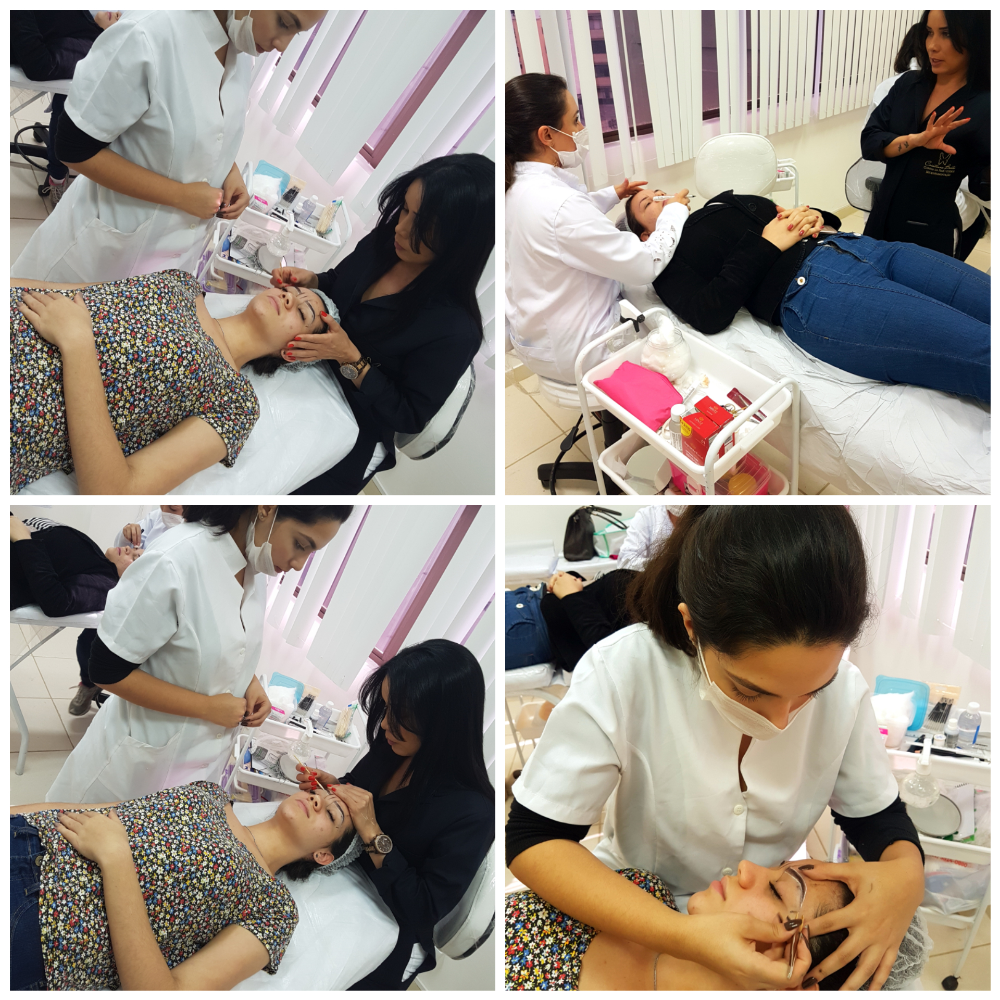

Além dos cursos profissionalizantes os principais serviços oferecidos na clínica são: Limpeza de pele, tratamento para manchas, micropigmentação e o tratamento exclusivo para estrias.

Empresária, influenciadora digital, empreendedora, é o que as profissionais de estética poderão se tornar se especializando em micropigmentação ou estria, além de conquistar a própria independência financeira.

Invista em equipamentos de qualidade

Na clínica a estrutura da sala de curso é ideal e bastante equipada, bem organizada, com turmas reduzidas e um ambiente aconchegante. Com uma ampla bagagem de experiência profissional a própria Cristiane Berto leciona os cursos e acredita no potencial de cada aluna, formando profissionais qualificadas e capacitadas de maneira que possam entregar a seus clientes serviços relevantes e de qualidade com baixo investimento e tendo retorno financeiro imediato.

 

<iframe width="100%" height="315" src="https://www.youtube.com/embed/IOQ9yVqJlDY" frameborder="0" allow="autoplay; encrypted-media" allowfullscreen></iframe>

Com esta proposta de oferecer um atendimento diferenciado a Clínica da Pele Cristiane Berto oferece condições especiais para novas turmas com preços acessíveis, que podem ser parcelados em até 10 vezes, no cartão. Para facilitar ainda mais a participação de quem já é do ramo da beleza, os cursos ocorrem de acordo com a necessidade da aluna. Além disso, contam com modelos e a turma é pequena, não tem mais do que cinco alunos para garantir que todas possam tirar suas dúvidas.

Serviço - A clínica fica localizada na Av. Amazonas | 687 | Sala 405 - No prédio da Academia R9 - Ao lado da MARISA - Próximo da Praça Sete - Esquina com Rua São Paulo – CENTRO/BH

Para saber mais sobre as técnicas e depoimentos de ex-alunas acesse nosso canal no [YouTube](https://www.youtube.com/channel/UCsGKgC73h2LMWi2ZQOib8XQ) ou siga no [Instagram](https://www.instagram.com/cristianebertooficial/?hl=pt-br)
